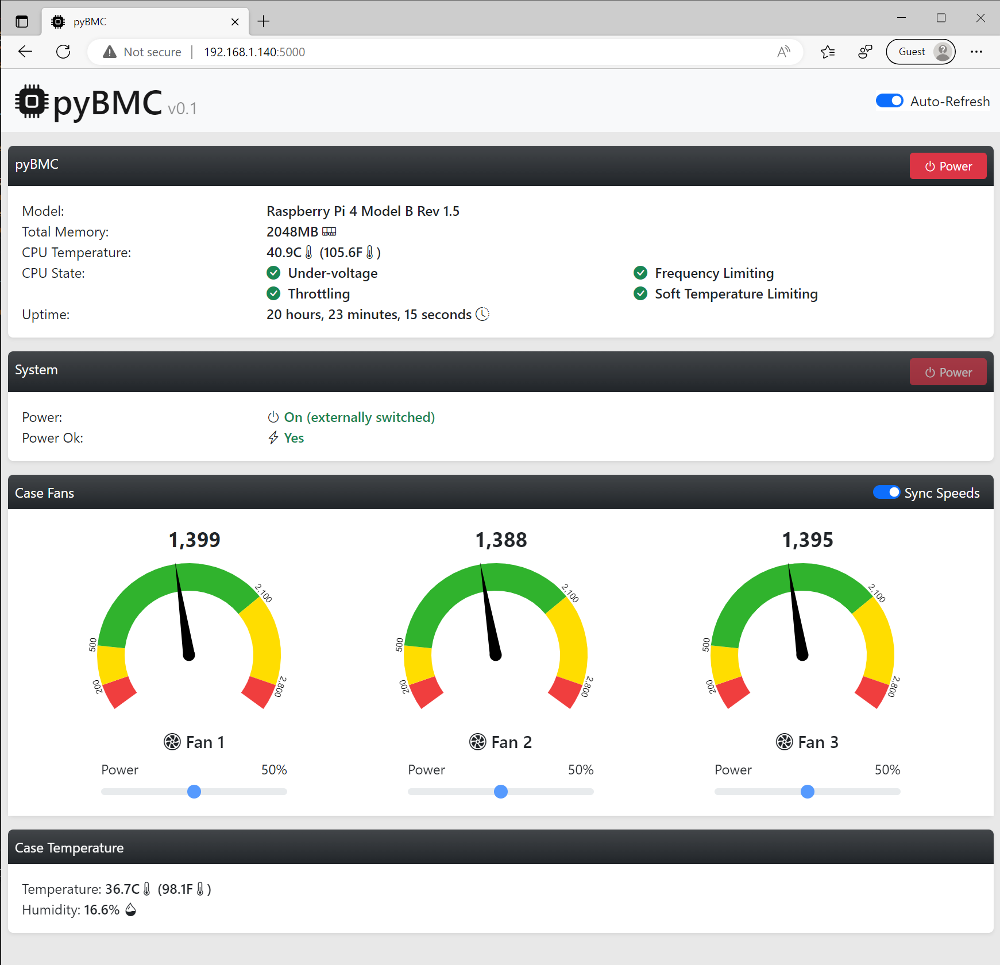
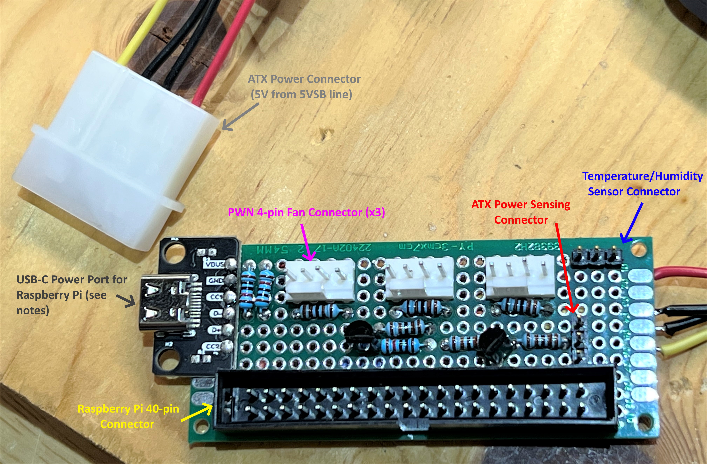

# pyBMC

pyBMC is a Raspberry Pi based project written in Python that aims to approximate
the functionality of the [BMC (Baseboard Management Controller)](https://en.wikipedia.org/wiki/Intelligent_Platform_Management_Interface#Baseboard_management_controller) component
of an [IPMI](https://en.wikipedia.org/wiki/Intelligent_Platform_Management_Interface)
system. BMCs are specialized microcontroller embedded on server motherboards and
are used to remotely monitor it and control it.



pyBMC does not intend to support the full set of functionality provided by a real
BMC. It does not make use of IPMI's native remoting protocols (RMCP) either. Instead,
it exposes functionality through a web application and a web API.

## Features

The current version of pyBMC supports:

- Turning the target system on and off (remote power switching)
- Read-only view of the "Power OK" signal from the power supply
- PWM speed control and RPM sensing for 12V fans
- Individual or synchronized PWM speed control of fans
- Temperature and humidity monitoring for target system
- Monitoring of the state of the host Raspberry Pi where pyBMC is running:
  - System configuration (model, total memory, etc)
  - CPU temperature
  - CPU state (under-voltage, throtlling, temperature and frequency limiting flags)
  - Uptime

## Hardware

pyBMC requires custom hardware to work. The custom hardware, called the BMC board,
has connector for sensors and fans and it connects to the Raspberry Pi's 40-pin
connector.

The pyBMC project includes the design of a BMC board. The schematics for current
version (version 0), can be seen below:

[](hardware/pyBMC%20BMC%20Board%20Schematic%20v0.pdf)

A prototype board is shown below:



### BMC Board Features

- 4-pin connectors for 3 12V fans
- ATX power sensing
- ATX "Power OK" sensing
- DHT22 temperature and humidity sensor connector

### Known Issues

The original BMC board design includes a USB-C port to power the host Raspberry Pi.
That USB-C port's 5V pin is fed through the ATX 5VSB line off of the power supply,
so it could keep pyBMC running while the target system was off.

The ATX 5VSB line is apparently notorious for not being stable. That was no different
on my own power supply. The 5VSB line sags down to 4.8V or lower at times which,
while not low enough to reset the Raspberry Pi, it triggers its under-voltage
sensors and it cuts power to the GPIOs, causing fan sensing and control to misbehave.

For now the USB-C port is not being used. External power through a separate power supply
is needed if you want pyBMC to control power to the target system. This issue will
be revisited in the next version of the BMC board.

### Hardware Instalation

I tested pyBMC with a Raspberry Pi 4 with 2GB of RAM. However, I believe a Raspberry
Pi 3 with 1GB+ of RAM should be enough (untested).

Installation is pretty straigh-forward.

1. Use a ribbon cable to connect pyBMC to the Raspberry Pi's 40-pin connector
2. Plug in the fans into the corresponding connectors (I'm using **Noctua NF-A14 industrialPPC-3000 PWM** fans)
3. Plug-in a DHT22 sensor to the temp connector

Done!

## Software

### Software Installation

From a Raspberry Pi SSH session, run this:

```
wget -qO - https://raw.githubusercontent.com/brunokc/pyBMC/main/setup_pybmc.sh | bash -
```

This will install pyBMC on your Raspberry Pi as a service, so it will start
automatically every time your Raspberry Pi boots up.

To see pyBMC's dashboard, open a browser and point to the IP address of your pyBMC
device and use port 5000. For instance:

```
http://192.168.1.140:5000
```

Please note that TLS is not currently supported.

### Customizations

If you design your own pyBMC BMC board, please edit [pybmc.hardware.conf](pyBMC/pybmc.hardware.conf) to reflect the GPIO mapping you chose to use.

Also, take a look at [pybmc.conf](pyBMC/pybmc.conf) to set some of the defaults
to your own preferences.

## Acknowledgements

pyBMC was born from inspiration taken from the work of Jason Rose on his [homelab](https://jro.io/nas/#expansion). Jason's code can be found on his [GitHub repository](https://github.com/edgarsuit/FreeNAS-Fan-Control).

## References

- [Noctua Connector & 4-pin Configuration](https://noctua.at/en/productfaqs/productfaq/view/id/215/)
- [Noctua PWM Specification White Paper](https://noctua.at/pub/media/wysiwyg/Noctua_PWM_specifications_white_paper.pdf)